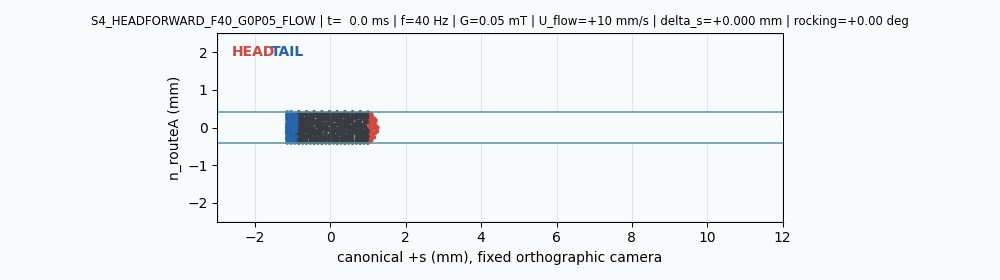
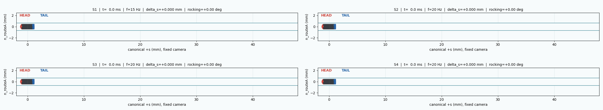
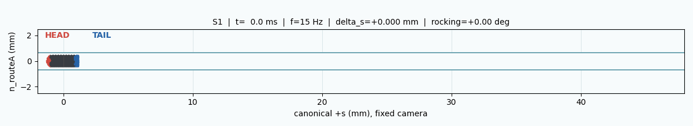
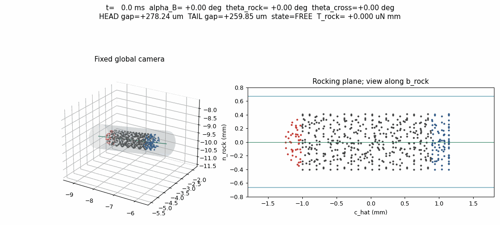
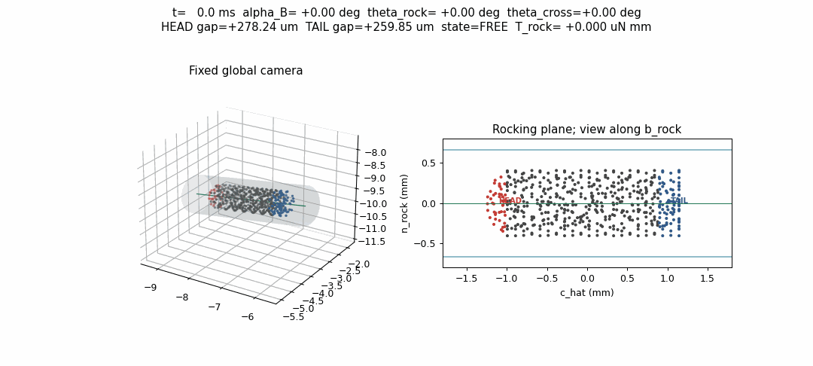
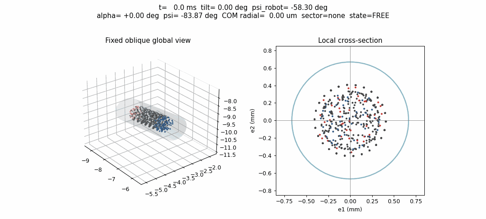
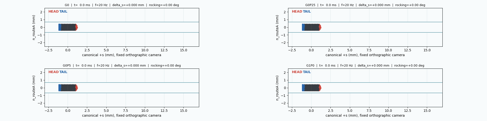
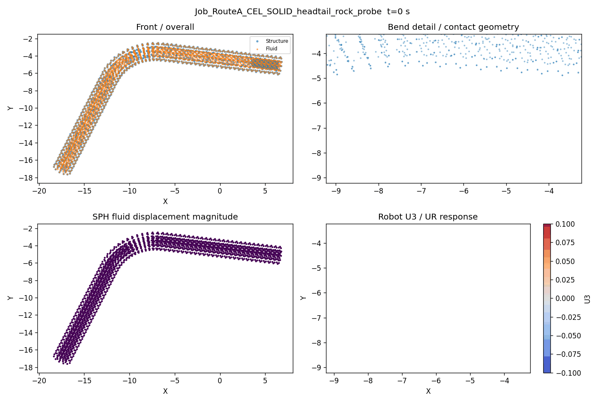

# Robot Motion GIF Watch Index

这是当前 `abaqus_robot` 工作链条的唯一 GIF 入口。先看“当前观看队列”；其余内容明确标为验证参考、对照或 Legacy，不能当作新的候选动力学。

## 当前观看队列

观看顺序：`1 → 2 → 3-6`。

### 1. 最新单 case：F40 + diagnostic background flow

**Case:** `S4_HEADFORWARD_F40_G0P05_FLOW`  
**参数:** `40 Hz`, `A_main=14.3431 deg`, `A_cross=2.5 deg`, `G=0.05 mT`, `U_flow=+10 mm/s`  
**时长:** `37.5 ms`  **模式:** straight tube, non-CEL, fixed RouteA side view  
**来源:** commit `24aec94`  
**用途:** 当前最新的单 case 快速视觉检查；`U_flow` 明确是 `DIAGNOSTIC_SCREENING_FLOW_ONLY`。

[打开 F40 慢速 GIF](F40LowGBackgroundFlowScreen/S4_HEADFORWARD_F40_G0P05_FLOW_SLOW.gif)

配套报告：[F40 screening report](F40LowGBackgroundFlowScreen/S4_HEADFORWARD_F40_G0P05_FLOW_Screen.md)。本机没有 `ffmpeg`，因此该 case 没有伪造 MP4 替代文件。

### 2. 上一轮 fast straight 总览：4-way

**来源:** commit `7f6c489`  
**共同设置:** `G=6 mT`, `L=45 mm`, `B0=10 mT`, fixed 2D RouteA camera, four new non-CEL dynamics cases  
**用途:** 4 个 fast straight candidates 的统一对比入口；不自动排名。

[打开 4-way GIF](FastStraightDynamicScreen/FastStraightScreen_4Way.gif)

### 3-6. Fast straight 单 case

这些是同一批新 dynamics 的单独 GIF，参数和顺序固定：

#### 3. `S1` — 15 Hz / 12 deg / planar

[打开 FAST_S1_2D.gif](FastStraightDynamicScreen/FAST_S1_2D.gif)

#### 4. `S2` — 20 Hz / 12 deg / planar

[打开 FAST_S2_2D.gif](FastStraightDynamicScreen/FAST_S2_2D.gif)

#### 5. `S3` — 20 Hz / 14.343 deg / planar

[打开 FAST_S3_2D.gif](FastStraightDynamicScreen/FAST_S3_2D.gif)

#### 6. `S4` — 20 Hz / 14.343 deg / elliptic 2.5 deg

[打开 FAST_S4_2D.gif](FastStraightDynamicScreen/FAST_S4_2D.gif)

## 已验证运动参考

下面用于确认 rocking 拓扑、HEAD/TAIL 语义和 precessing 参考，不是当前 fast-forward 候选。

### Stable local rocking：5 Hz

**来源:** commit `8afaa9d`  
[PROD_LOCAL_ROCK10_5HZ_G0_STRAIGHT_DualView.gif](LocalHeadTailRocking/PROD_LOCAL_ROCK10_5HZ_G0_STRAIGHT_DualView.gif)

### Light-contact rocking：14.343 deg case

**来源:** commit `5f6bb77`  
[PROD_LOCAL_ROCK_TOUCH_5HZ_G0_STRAIGHT_DualView.gif](LocalHeadTailRocking/PROD_LOCAL_ROCK_TOUCH_5HZ_G0_STRAIGHT_DualView.gif)

### Precessing reference：10 Hz / 2.5 Hz precession

**来源:** commit `7069326`  
[PROD_LOCAL_PRECESSROCK_10HZ_PREC2P5_G0_STRAIGHT_DualView.gif](LocalPrecessingRocking/PROD_LOCAL_PRECESSROCK_10HZ_PREC2P5_G0_STRAIGHT_DualView.gif)

补充对照：[ROCK10_vs_LIGHTCONTACT.gif](LocalHeadTailRocking/ROCK10_vs_LIGHTCONTACT.gif) · [PLANAR5HZ_vs_PRECESSING10HZ.gif](LocalPrecessingRocking/PLANAR5HZ_vs_PRECESSING10HZ.gif)

补充单视图与场路径：

- [ROBOT_LOCAL_ROCKING_Field_OneCycle.gif](LocalHeadTailRocking/ROBOT_LOCAL_ROCKING_Field_OneCycle.gif)
- [RouteA_vs_LightContactMagneticRocking.gif](LocalHeadTailRocking/RouteA_vs_LightContactMagneticRocking.gif)
- [RouteA_vs_MagneticRocking.gif](LocalHeadTailRocking/RouteA_vs_MagneticRocking.gif)
- [PRECESSING_ROCKING_FieldPath.gif](LocalPrecessingRocking/PRECESSING_ROCKING_FieldPath.gif)
- [PRECESSING10HZ_ContactSector.gif](LocalPrecessingRocking/PRECESSING10HZ_ContactSector.gif)

## S4 低 G 对照组

这是 F40 flow screen 之前的四个 S4 head-forward、无背景流低 G dynamics。它们保留用于比较，不要与“当前最新单 case”混淆。

**来源:** commit `8ccddd8`  
**参数:** `B0=10 mT`, `G=0 / 0.25 / 0.5 / 1.0 mT`, no background flow  

[S4_HEADFORWARD_LowG_4Way.gif](S4HeadForwardLowGScreen/S4_HEADFORWARD_LowG_4Way.gif)

- [S4_HEADFORWARD_G0_2D.gif](S4HeadForwardLowGScreen/S4_HEADFORWARD_G0_2D.gif)
- [S4_HEADFORWARD_G0P25_2D.gif](S4HeadForwardLowGScreen/S4_HEADFORWARD_G0P25_2D.gif)
- [S4_HEADFORWARD_G0P5_2D.gif](S4HeadForwardLowGScreen/S4_HEADFORWARD_G0P5_2D.gif)
- [S4_HEADFORWARD_G1P0_2D.gif](S4HeadForwardLowGScreen/S4_HEADFORWARD_G1P0_2D.gif)

## Legacy 仅参考

### RouteA CEL solid head-tail probe

**来源:** commit `6cabb09`   
**状态:** legacy comparison only；不是当前 production，不是新候选，不代表当前 ReducedHydro/F40 flow case。

[Job_RouteA_CEL_SOLID_headtail_rock_probe.gif](Legacy_Wobble_GIFs/Job_RouteA_CEL_SOLID_headtail_rock_probe.gif)

## 判读规则

- 当前候选只看“当前观看队列”中的 1-6。
- GIF 中的 `HEAD`、`TAIL`、物理时间和 fixed RouteA 侧视图优先用于人工视觉选择。
- 旧 ODB 只作 comparison；本页列出的 fast candidates 来自新 dynamics runs。
- 不在本页默认观看队列中的 GIF，不应被解释为当前候选或自动排名结果。

**USER VISUAL SELECTION REQUIRED**
