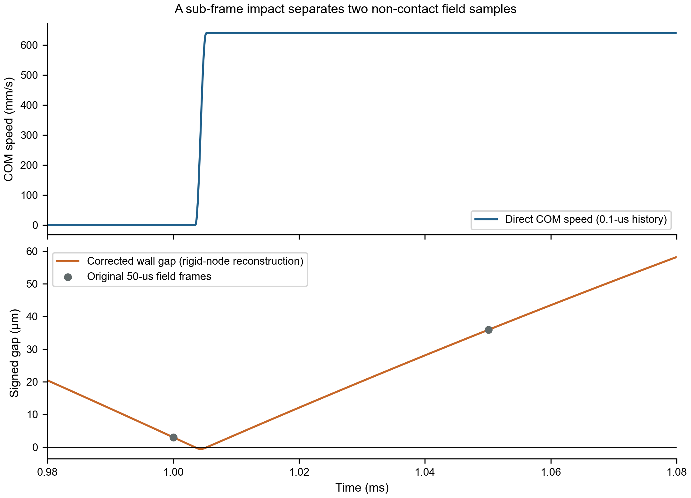
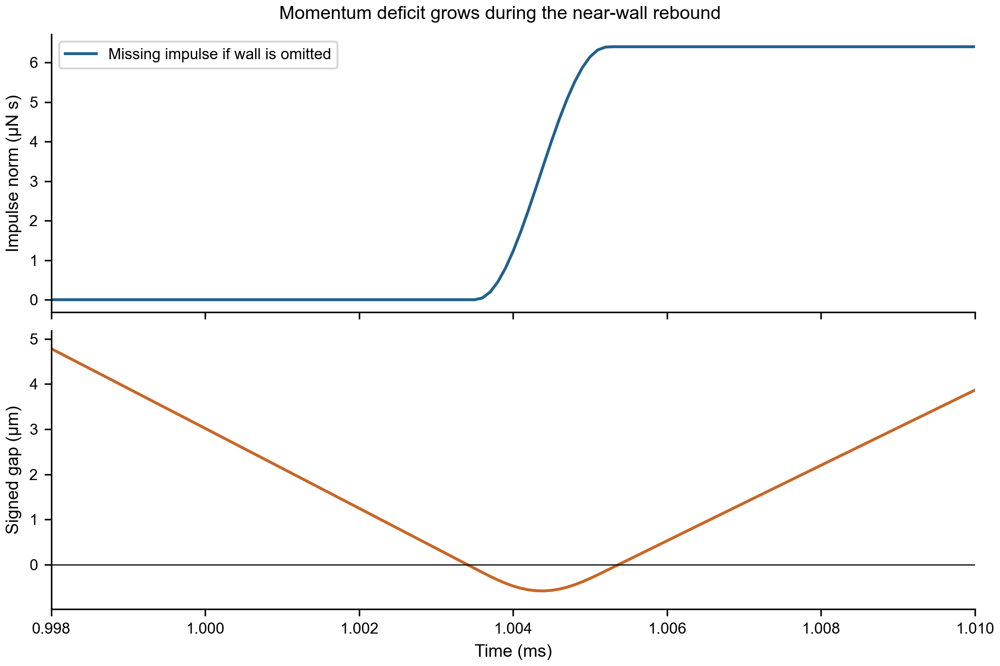
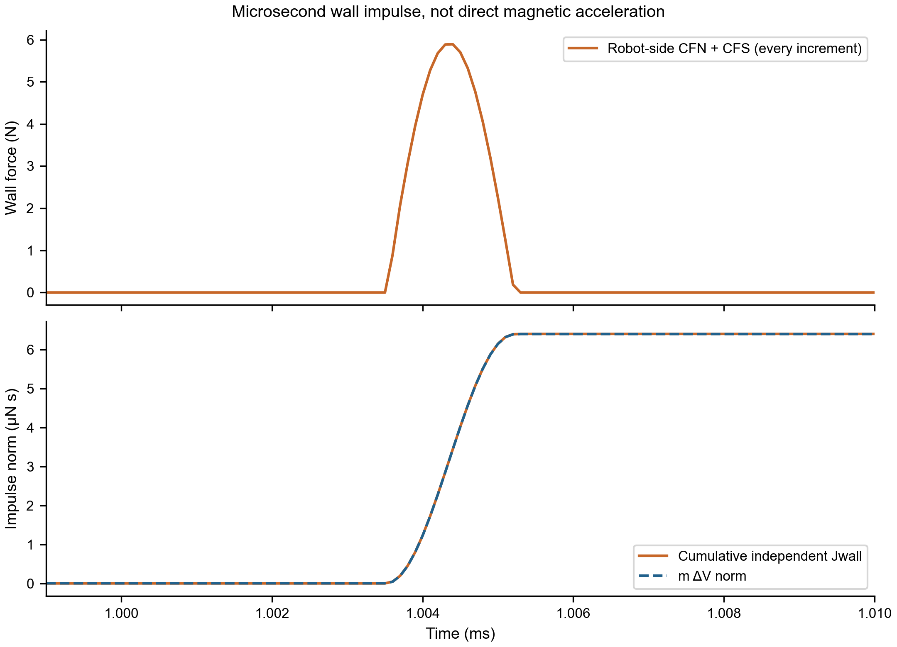
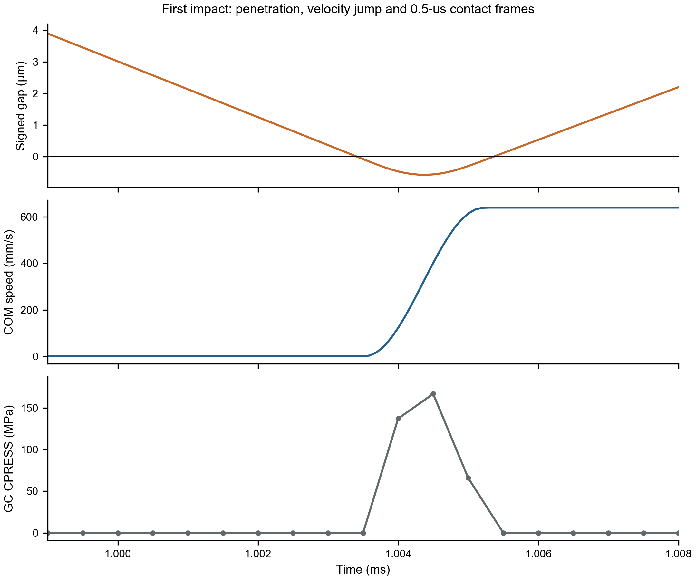
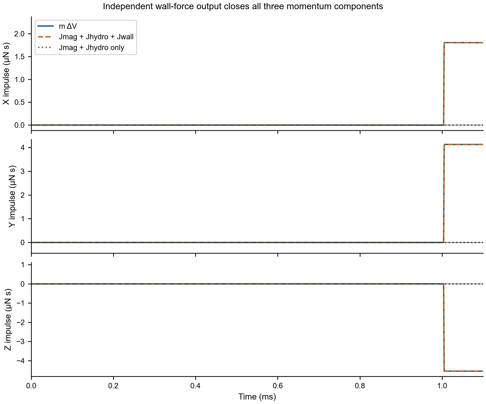
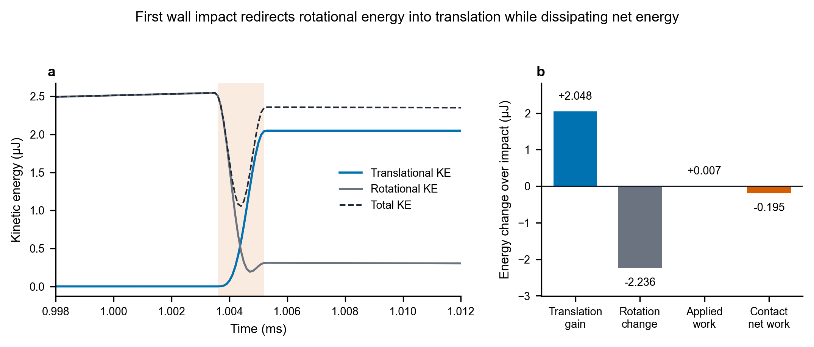

# ReducedHydro force transfer and hidden-impact audit

Authoritative input baseline: `504d098a6674f7d0e5cf448e1cbcc0107323bf1c`.

**Decision: `FORCE_TRANSFER_VALID_HIDDEN_WALL_IMPACT_CONFIRMED` (A).**

本轮完成 Stage A 旧数据审计，并在四项门禁全部通过后，仅执行一个 1.3 ms 加密诊断。生产磁场、hydro、几何、质量、惯量、接触和固定 0.1 µs 步长均未修改。结果不是“猜测存在撞墙”，而是独立接触合力积分已解释了速度突跃。

## 1. Why the current RH-D classification is not yet final

旧 `RH-D REDUCED_HYDRO_IMPLEMENTATION_INVALID` 判定撤销。它把 0–6.15 ms 全部视为无接触，又在 `finish_reduced_hydro_fixed.py` 的梯形积分中多乘一个 0.5，使外力冲量少算一半。该脚本已修正积分并将窗口重命名；旧 report 明确标记 superseded，旧分类生成器已停用，防止重新产出错误结论。

本轮仅判定**当前离散模型的线动量力链闭合及漏采接触事件**；不据此宣称接触压强物理收敛、无穿透或持续 wobble。当前 direct 时间步不会由 Explicit 自动检查稳定性，13 个既有警告仍需保留：12 个 VUAMP 接口提醒（实际参数含 NPROPS/PROPS）、4 个 distorted elements 合并为 1 条警告。没有新增输出变量错误。

## 2. 50-us output undersampling

原 ODB 有 2 个 history regions，83,331 点 U/UR/V/VR 传感器历史；普通 RP CF、RF、加速度等各 168 点。原 CNORMF/CSHEARF/CPRESS 只有 168 个 field frames，典型间隔 50 µs，约 500 个积分步。没有历史接触合力。`CF1/2/3` 是集中外载荷，不是 contact force。

新增诊断输出 CFN/CFS/CFT **每增量 0.1 µs**，两侧各 13,001 点；contact/robot field 每 0.5 µs，共 2,601 帧。接触仍为相同的 single-wall General Contact，未换 Contact Pair/SplitWall。

## 3. 1.000-ms near-wall event

发现并修复最近点实现错误：旧三角平面投影用了 `q=A−n h/|n|²`，应为 `q=P−n h/|n|²`。新版对 interior/edge/vertex/平面两侧做独立单元测试，并以 centroid bounding-radius 排除规则保证最近三角候选完整。符号为 lumen 内正；中心线仅用于定向法向，**不是距离代理**。

真实 exterior mesh 为 **430 个三角面、217 个唯一外表面节点**，而不是把表面相邻四面体的所有节点（含内部）混算。管壁 764 个 R3D4，分成 1,528 个三角。旧 gap 数字保留为历史，不再当精确现值。

| Time | Old reported gap | Corrected sampled gap | Field CPRESS |
| --- | --- | --- | --- |
| 1.0000 ms | +2.279 µm | +3.015865 µm | 0 |
| 1.0501 ms | +35.026 µm | +35.934607 µm | 0 |

既有增量姿态已能重构这两帧间的过零；诊断每增量几何检查测得最小 gap **-0.582271 µm at 1.0044 ms，node 130 / wall element 441**。此值是实际壁三角上的 node gap，不等同于积分点 COPEN、也不替代 edge-edge 检查。

用 actual ODB robot nodes 交叉检查 `R=Rotation.from_rotvec(UR)`，诊断抽检最大节点重构误差 0.000314326 µm；旧导出坐标误差 0.00170472 µm（含写出精度）。禁止以 Euler/逐帧 PCA 换号重建。

## 4. Velocity jump

旧轨迹和新诊断在同一 13,001 个显式增量上的 U/UR/V 完全一致（误差为 0），确认加密输出没有改变动力学。1.0000→1.0501 ms 的 ΔV 为 **(180.609025, 412.659249, -455.007554) mm/s**，模 **640.264906 mm/s**。

真正首次 wall force 非零在 1.0036 ms；第一脉冲仅约 **1.7 µs（17 个增量）**，远短于 50 µs。第二次事件在 1.2711–1.2729 ms。并非 1 ms 处突然解除 BC 或切换载荷；磁场 ramp 在 1 ms 平滑结束，生产实现原样保留。

## 5. CLOAD inventory

| amplitude | DOF | reference_magnitude | unit |
| --- | --- | --- | --- |
| SOCKET_FX | 1 | 1 | N |
| SOCKET_FY | 2 | 1 | N |
| SOCKET_FZ | 3 | 1 | N |
| SOCKET_MX | 4 | 1 | N mm |
| SOCKET_MY | 5 | 1 | N mm |
| SOCKET_MZ | 6 | 1 | N mm |
| HYDRO_FX | 1 | 1 | N |
| HYDRO_FY | 2 | 1 | N |
| HYDRO_FZ | 3 | 1 | N |
| HYDRO_MX | 4 | 1 | N mm |
| HYDRO_MY | 5 | 1 | N mm |
| HYDRO_MZ | 6 | 1 | N mm |

同一 DOF 上 SOCKET 与 HYDRO 是两个不同载荷来源，不是重复加载。无多余 SOCKET 或 HYDRO amplitude，没有额外 1e3/1e-3 缩放。新增每增量 RP CF 与实际 logged Fmag+Fhydro 最大差 **3.8489e-13 N**。

## 6. Unit audit

Abaqus consistent units: mm, tonne, s；`1 tonne·mm/s² = 1 N`。Torque = N·mm；velocity = mm/s；linear momentum = tonne·mm/s = N·s。10 mg = 1e−8 tonne = 1e−5 kg。积分时间始终 s；图示 ms/µs 仅显示换算。没有把 µm 当 mm、ms 当 s、CPRESS 直接积分成 force 或对 nodal resultant 重复乘面积。

对原 ODB history 时间的 float32 存储量化，诊断积分按已知固定步长恢复 `round(t/1e−7)*1e−7`；最大修正 5.819e-11 s，不改变任何仿真时间步。未作力/动量拟合或经验缩放。

## 7. Actual rigid-body mass

| part | element_count | volume_mm3 | density_tonne_mm3 | mesh_mass_mg |
| --- | --- | --- | --- | --- |
| Pipe_SOLID | 5203 | 101.5269 | 1e-09 | 101.5269 |
| Robot_SOLID | 1431 | 1.280559 | 7.809067e-09 | 9.999973 |

robot 实际有效计算质量 **9.999972584 mg**，来自全部 1,431 个 C3D4 的体积×密度。没有 RP point MASS、rotary-mass 替代、质量缩放或其它材料贡献。STA 只打印 whole-model mass=1.11527e−7 tonne，不能冒充 robot-only mass；两部分计算和为 1.11526911652e-07 tonne，与 STA 打印精度一致。独立运动方程闭合进一步验证这个质量，没有调整质量去凑结果。

## 8. RP versus COM

RP = (−7.468174204284, −3.676918015967, −9.550745259298) mm；tetra volume-weighted COM 与其差 **5.20442e-10 µm**。实际计算使用 `V_COM=V_RP+omega×R r0`，而非默认任意 RP 就是 COM。这里修正量可忽略。

clean window 内，原每增量 direct V vs central dU/dt 的误差中位数 **1.31832e-06 mm/s**、最大 **9.22281e-05 mm/s**。碰撞处导数敏感不应用来判传感器失效。

## 9. Other external loads

本模型 CEL 流体已删除，以明确的 RP dissipative hydro 代替。无 gravity/DLOAD/DSLOAD、初速度、机器人规定运动、连接器、额外约束反力或 step transition。RP_PIPE ENCASTRE 是静止墙的支撑，不是第二份应加到 robot 动量的力。刚体内部约束力不能重复加入整个 robot 的外力和。

保留 bulk-viscosity 卡，但这里没有可变形的流体/结构自由度，不能无证据把缺口记作 bulk viscosity/artificial force。wall normal damping/friction 已计在求解器接触合力中；hydro 独立计入一次。最大全程闭合残差并未要求另造 Jother。

## 10. Clean no-contact momentum window

0–0.95 ms：新增每增量独立 contact resultant 最大值 **0 N**。原 telemetry 插值核算 residual=0.000770084（0.07701%）；加密 F telemetry 后 residual=2.27248e-08。原 0.077% 主要来自 50 µs magnetic telemetry 插值，不是 CLOAD 失效。

## 11. Suspected hidden-contact window

原数据的窗口审计（仍缺实测 wall impulse）：

| window | start_s | end_s | mDeltaV_norm_Ns | missing_norm_Ns | relative_residual |
| --- | --- | --- | --- | --- | --- |
| A_clean | 0 | 0.00095 | 2.957829e-09 | 2.277778e-12 | 0.0007700842 |
| B_suspected | 0.00095 | 0.0011 | 6.401903e-06 | 6.40314e-06 | 1.000193 |
| C | 0.0011 | 0.00125 | 1.69685e-09 | 8.635687e-13 | 0.0005089246 |
| D | 0.0012 | 0.00135 | 6.943635e-06 | 6.942762e-06 | 0.9998743 |
| E | 0 | 0.00615 | 5.535151e-06 | 5.567243e-06 | 1.005798 |

A 窗口闭合、1 ms gap 极小、B 窗口突发缺失冲量、原数据无高频 wall force，四个条件全部成立，才批准程序进入唯一诊断。C 窗口重新闭合，D 窗口再次出现缺失冲量，对应新增诊断捕获的第二脉冲。E=0–6.15 ms 包含更多未知漏采事件，**不能把 1.3 ms 的 wall force 移植到整个 E 窗口，假装已独立闭合 6.15 ms**。

## 12. Existing contact history

已有 ODB 不能独立重建 Jwall。只用 ΔP−Jmag−Jhydro 定义“墙冲量”会成为 accounting identity，不是验证。本次使用 Abaqus 2025 支持的 General Contact surface history：CFN、CFS、CFT；surface 指定 robot 和 helper wall，各自记录。该功能不改变接触架构。[Abaqus 2025 General Contact output](https://docs.software.vt.edu/abaqusv2025/English/SIMACAEITNRefMap/simaitn-c-contactgeneral.htm)

具体输出为 `*OUTPUT,HISTORY,FREQUENCY=1` + `*CONTACT OUTPUT,SURFACE=ROBOT_SOLID-1.ROBOT_SOLID_SURF` + `CFN,CFS,CFT`，wall 侧另写同样请求。field 请求 CSTRESS/CFORCE，每 0.5 µs；CPRESS 只在实有 field 样本填写，其余增量 CSV 留空。[Abaqus 2025 CONTACT OUTPUT syntax](https://docs.software.vt.edu/abaqusv2025/English/SIMACAEKEYRefMap/simakey-r-contactoutput.htm)

## 13. Wall impulse reconstruction

只对 robot side `CFN+CFS` 积分；wall side 只用于 action/reaction 验证，绝不一起加进动量。

- robot CFT + wall CFT 最大误差 = **0 N**。
- CFT vs CFN+CFS 最大误差 = 4.38134e-07 N，相对约 6 N 峰值是单精度输出舍入量级。
- 同时刻机器人节点 CNORMF+CSHEARF 求和 vs surface history 最大差 = **4.44089e-16 N**；不再乘面积。
- first impact |Fwall| 峰值 = **5.891618 N**，脉冲17步。首撞0.5 µs场采样 CPRESS峰值 = **166.92860 MPa at 1.0045 ms**。全1.3 ms最大CPRESS=178.79411 MPa，发生在第二次事件，不混作首撞。
- first impact Jwall = **(1.806354196e-06, 4.126928774e-06, -4.550356817e-06) N·s**，模 **6.403140147e-06 N·s**。
- normal J = [1.6640849638729956e-06, 4.202076924592172e-06, -4.5329220980404905e-06] N·s；shear J = [1.4226923212408957e-07, -7.514815090690065e-08, -1.7434718582083274e-08] N·s；摩擦分量已计。

磁力为 µN 级，hydro 小且耗散；wall contact 为数 N 但仅数 µs。三者量级差别解释了为何微小直接磁力可以与碰撞后的数百 mm/s COM速度同时出现。静止壁通过约束冲量改变平动/转动动量；本轮没有证明壁面创造能量，转动→平动及耗散能量分配留待单独核算。

## 14. Momentum closure

独立核查 `mΔV_COM = ∫Fmag dt + ∫Fhydro dt + ∫(CFN+CFS)_robot dt`。
relative residual 定义为 `|residual| / max(|mΔV|, |ΣJ|)`；全部 global XYZ 后积分，未先投影，未用残差反推 measured wall force。

| window | mDeltaV_norm_Ns | Jmag_norm_Ns | Jhydro_norm_Ns | Jwall_norm_Ns | relative_without_wall | relative_residual |
| --- | --- | --- | --- | --- | --- | --- |
| A_clean | 2.957829e-09 | 2.958829e-09 | 1.02806e-12 | 0 | 2.272478e-08 | 2.272478e-08 |
| B_first_impact | 6.401903e-06 | 6.059316e-10 | 7.159838e-10 | 6.40314e-06 | 1.000193 | 2.117728e-08 |
| C_after_first | 1.69685e-09 | 6.001917e-10 | 1.123504e-09 | 0 | 6.658093e-05 | 6.658093e-05 |
| D_second_impact_clipped | 6.943492e-06 | 3.922395e-10 | 5.530548e-10 | 6.942765e-06 | 0.9998953 | 1.311207e-08 |
| all_1p3ms | 2.424861e-06 | 4.360462e-09 | 2.016917e-09 | 2.426866e-06 | 1.000827 | 3.005755e-08 |
| first_impact_detail | 6.402235e-06 | 3.952405e-10 | 5.660916e-10 | 6.40314e-06 | 1.000141 | 1.023463e-08 |

无 wall 的 B residual ≈100.019%；加入独立 wall 输出后 ≈**2.117728e-06%**。全1.3 ms残差≈**3.005755e-06%**。C窗口动量变化非常小，因此单精度 V 的差分量化带来较高相对残差（仍仅约0.00666%）。这些是**动量记账正确性**证据，不是刚性碰撞峰值网格/时间步收敛或实验真实性证明。

## 15. Decision

**A — `FORCE_TRANSFER_VALID_HIDDEN_WALL_IMPACT_CONFIRMED`**。

生产 force-transfer/CLOAD/单位链路在本次冻结配置下有效；旧 RH-D 判断由未计的 interframe wall impulse 和后处理积分错误造成。6.15 ms 正式重标为 **FIRST_CONTACT_CAPTURED_IN_50US_FIELD_FRAMES**，不是 first physical contact。新的首次求解器活跃接触为 **1.0036 ms**。不调整 B、频率、尺寸、hydro 或接触参数；本轮不重新分类 wobble RH-A/B/C。

### Required direct answers

1. **0–0.95 ms 是否无接触？** 在当前模型的 0.1 µs 增量分辨率下是：独立 robot-side 接触合力全为 0，且 gap 在 0.95 ms 仍约 +45.658 µm。

2. **干净窗口是否闭合？** 是。旧数据重新积分残差 0.077008%；每增量力输出复核 2.27248e-08（无量纲），约 2.27248e-06%。

3. **actual effective mass？** 9.999972584 mg = 9.99997258392e-09 tonne = 9.99997258392e-06 kg；体积×密度，无额外质量项/质量缩放。

4. **RP–COM offset？** 5.20442e-10 µm，输入精度下可视为重合。

5. **使用哪个 velocity？** 使用 V_COM = V_RP + ω×R r0；本例修正可忽略，但公式已实际应用。

6. **其它遗漏外力？** 唯一漏算项是 wall normal + shear impulse。CEL 已移除；无重力、DLOAD、连接器、机器人 prescribed motion 或初速度。管壁固定反力不应再与已计 wall-on-robot force 重复相加。

7. **CLOAD reference 都为 1？** 是，6 个 SOCKET + 6 个 HYDRO，12 项全部为 1。

8. **force unit？** N。tonne·mm/s² = N；力矩 N·mm；线冲量 N·s。

9. **duplicate CLOAD？** 无误重复。每 DOF 的 SOCKET 与 HYDRO 是两个不同的预期外载荷，相加不是 double scaling。

10. **两帧多少增量？** 通常 500；所指 1.0000–1.0501 ms 两帧为 501 个 0.1 µs 增量。

11. **1.000 ms gap？** 修正投影后 +3.015865 µm；旧 +2.279 µm 数值作废，但极近壁判断不变。

12. **1.0501 ms gap？** 修正后 +35.934607 µm；旧 +35.026 µm 被替代。

13. **两帧 ΔV？** XYZ = (180.609025, 412.659249, -455.007554) mm/s，模 640.264906 mm/s。

14. **原 ODB 有增量接触历史？** 没有。原增量 history 是 U/UR/V/VR 传感器；CF/RF 等仅 168 点，没有 CFN/CFS/CFT contact region。

15. **能从旧数据直接得到 Jwall？** 不能独立测得。ΔP−Jmag−Jhydro 是未解释冲量而非壁力测量。可由旧高频 UR/U 重构微米级 gap 过零，但不能替代接触合力积分。

16. **加入 Jwall 后 residual？** 首撞 B 窗口 2.11772772e-08；完整 1.3 ms 3.00575471e-08，均无量纲。

17. **6.15 ms 是 first physical contact？** 不是。已捕获 first solver-active wall contact = 1.0036 ms。

18. **6.15 ms 如何命名？** FIRST_CONTACT_CAPTURED_IN_50US_FIELD_FRAMES。

19. **旧 RH-D 原因？** 遗漏微秒级 wall impulse，加上旧梯形积分额外乘 0.5 的后处理错误；不是生产 Socket/CLOAD 力传递失效。本轮不重新判 RH-A/B/C。

20. **是否需要唯一 rerun？** 需要且已执行完唯一 1.3 ms instrumentation-only 作业；四项 Stage A 门禁通过后提交。没有其它动力学 Job。

## 16. First-impact energy audit (completed; zero new Job)

使用同一 1.3 ms 加密 ODB 的每增量 `V/VR/UR`，按 C3D4 Explicit 集中质量惯量重建刚体动能。该惯量模型与 Abaqus `ALLKE` 的最大相对误差仅 **7.66e-07**；连续体四面体积分惯量则偏约 **2.520%**，因此采用前者作为求解器一致定义。

首撞力脉冲外扩一个积分肩点的 1.0035–1.0053 ms 窗口内：

- 平动能增加 **2.048226 µJ**；转动能减少 **2.236221 µJ**。
- 总动能减少 **0.187995 µJ**，碰撞后保留 **92.617%**。
- 磁场净输入仅 **0.007127 µJ**，hydro 净功 **-5.02014e-06 µJ**；二者不能直接生成 2.048 µJ 的平动能。
- 接触净功为 **-0.195117 µJ**（负号，净耗散）。扣除所有正外功后，至少 **2.041104 µJ**、即平动增益的 **99.652%**，来自撞前已储存的转动能。
- Abaqus 稀疏能量端点 1.0000–1.0501 ms 给出有效接触耗散 **0.195122 µJ**；每增量重建为 **0.195117 µJ**。两者差约 5.47×10⁻⁶ µJ，符号和量级独立一致。

因此强反弹不是墙面或 Socket “创造能量”，而是高速转动刚体撞击静止刚壁后将绝大部分转动能瞬时重定向为平动能，同时耗散约 0.195 µJ。该结论解释数值来源，但**不证明 92.6% 的总动能保留率符合真实软体机器人/管壁实验**。

## 17. Exactly one next step

**在任何新的长程 wobble 求解前，先用实验碰撞恢复系数或机器人/管壁的等效法向柔度与阻尼标定当前接触模型；随后只做同一 1.3 ms 首撞短窗的接触参数验证。** 不再扫描磁场通信频率/单位，也不以未标定的刚性强反弹继续推断输运性能。

### Reproducibility and scope

Scripts, inventories, small diagnostic INP, extracted CSV, PNG/PDF and this report are versioned. ODB、每增量 raw telemetry、二进制/private NPZ留在本机，不上传。现有8.333 ms baseline ODB未重跑/删除。`instrumentation_identity.json`记录物理前缀、原/新 INP及桥接源码哈希；`instrumentation_dynamics_regression.csv`记录动态严格复现。`first_impact_increment_history.csv`为0.98–1.08 ms逐增量清单，gap由实网格+验证过的刚体姿态重构；CPRESS缺采样处留空，不插造值。
