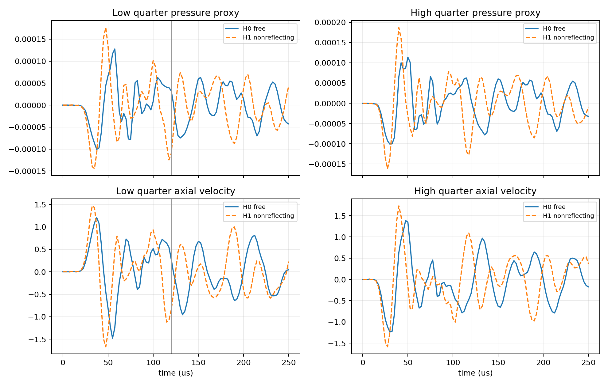
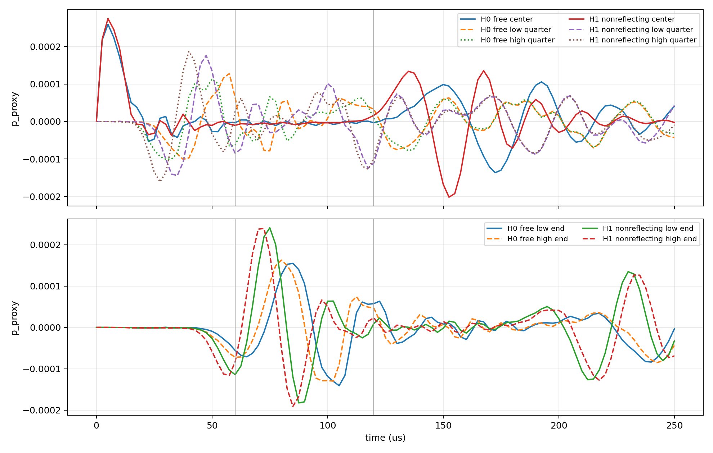

# F100 G2P20 CEL Boundary Harness Report

## Final harness classification

`CEL_BOUNDARY_TREATMENT_STILL_UNRESOLVED`

## Scope and cases

This was a fluid-only straight confined tube harness. It contained no robot, magnetic load, robot-wall contact, free robot dynamics, restart continuation, or through-flow command. The fluid used the production values: density `1.0007e-9 tonne/mm3`, viscosity `7.1e-10 N s/mm2`, USUP EOS, `c0=100000 mm/s`, axial spacing `0.272727 mm`, and cross-sectional spacing `0.075 mm`. The tube length was `12 mm` with 44 x 20 x 20 EC3D8R cells. A small symmetric pair of opposite axial velocity perturbations (`+10/-10 mm/s`) was applied near the center, producing zero net transport to first order.

- H0 `HARNESS_DEFAULT_FREE`: no `*EULERIAN BOUNDARY` keyword.
- H1 `HARNESS_NONREFLECTING`: the only INP change was:

```text
*Eulerian Boundary, OUTFLOW=NONREFLECTING
Fluid_EULERIAN-1.EUL_LOW
Fluid_EULERIAN-1.EUL_HIGH
```

Both runs completed to `0.25 ms`. Output spacing was `2.5 us`, giving approximately 100 frames over the interval. The expected center-to-end travel time is `60 us`; the expected round trip is `120 us`.

## Official boundary semantics

The Abaqus 2025 keyword reference documents `*EULERIAN BOUNDARY` with `OUTFLOW=FREE`, `NONREFLECTING`, `NONUNIFORM PRESSURE`, and `ZERO PRESSURE`. The reference describes `NONREFLECTING` as a radiation boundary for unbounded-domain truncation and states that it is unsuitable when significant material transport crosses the boundary. The reference used here is:

https://help-3dexperience.aesvietnam.com/English/SIMA3DXKEYRefMap/simakey-r-eulerianboundary.htm

H1 is therefore a diagnostic control for the present wave test, not an automatic production-model recommendation.

## Probe extraction

Matched probe regions were sampled at CENTER, LOW_QUARTER, HIGH_QUARTER, LOW_END_NEAR, and HIGH_END_NEAR. Extracted fields were Eulerian axial velocity, EVF, and the explicitly labelled:

`MEAN_NORMAL_STRESS_PRESSURE_PROXY = -trace(S_water)/3`

Native `PRESS` was not present in the ODB. The raw light results are in `boundary_harness_results/`.

## Reflection coefficients

The same windows were used for H0 and H1: incident `15–55 us`, return `70–125 us`. Arrival times are interpreted against the characteristic travel-time estimates only; they are not a substitute for a resolved waveform decomposition.

| Case | Probe | R_pressure | R_velocity | Pressure incident/return (us) | Velocity incident/return (us) |
|---|---|---:|---:|---|---|
| H0 free | low quarter | 0.672 | 0.490 | 55.0 / 75.0 | 55.0 / 110.0 |
| H0 free | high quarter | 0.579 | 0.568 | 50.0 / 75.0 | 47.5 / 110.0 |
| H1 nonreflecting | low quarter | 0.707 | 0.670 | 47.5 / 117.5 | 47.5 / 115.0 |
| H1 nonreflecting | high quarter | 0.681 | 0.630 | 40.0 / 117.5 | 40.0 / 117.5 |

The default free ends generate substantial returning disturbances on the robot-relevant time scale. The documented NONREFLECTING control does not reduce these returns in this harness; the return ratios remain of the same order and are slightly larger for the selected pressure windows. The incident and return timing also shifts between H0 and H1, so the result is not evidence that H1 is a validated production boundary.





## Interpretation and recommendation

The harness confirms that the current free-end treatment can return disturbances before and around the `100 Hz` robot time scale. It does not validate the NONREFLECTING candidate because the controlled comparison did not show a strong reduction. The boundary treatment therefore remains unresolved.

Do not run L48/L72/L100 or another full robot solve. Do not tune damping, contact, magnetics, or prescribed motion. If the physical experiment represents large ambient reservoirs or pressure-controlled tube ends, the next documented boundary candidate to evaluate is `OUTFLOW=ZERO PRESSURE`; that choice must follow the actual end condition and requires a new cheap fluid-only qualification before any robot replay. If the physical domain is a truncated unbounded fluid region with negligible through-flow, NONREFLECTING remains a diagnostic candidate but is not validated by this harness.

The prior force conclusion remains unchanged: `FLUID_FORCE_PARTITION_SEMANTICS_UNRESOLVED`. The harness addresses boundary-wave behavior only; it does not create an independent robot-fluid traction observable.

## 24 mm repair harness

To remove the short-domain timing ambiguity, the same H0/H1 comparison was repeated at 24 mm axial length, with all other mesh spacing, fluid properties, EOS, excitation, duration, and output cadence unchanged. The expected center-to-end travel time is 120 us and the expected round trip is 240 us. Both jobs completed successfully to 0.25 ms with no fatal solver error.

The analyzer used incident windows of 30-85 us and return windows of 160-215 us. The 24 mm reflection metrics were:

| Case | Probe | R_pressure | R_velocity | Pressure incident/return (us) | Velocity incident/return (us) |
|---|---|---:|---:|---|---|
| H0 free | low quarter | 0.344 | 0.463 | 75.0 / 162.5 | 72.5 / 215.0 |
| H0 free | high quarter | 0.352 | 0.540 | 70.0 / 215.0 | 70.0 / 215.0 |
| H1 nonreflecting | low quarter | 0.489 | 0.578 | 82.5 / 205.0 | 82.5 / 205.0 |
| H1 nonreflecting | high quarter | 0.506 | 0.590 | 80.0 / 202.5 | 80.0 / 202.5 |

The longer domain resolves the expected wave travel scale, but NONREFLECTING still does not suppress the returning disturbance. Its selected pressure and velocity ratios are higher than H0, not lower by approximately 50%. Therefore the controlled evidence remains insufficient to validate either boundary treatment for production use, and the final harness classification remains `CEL_BOUNDARY_TREATMENT_STILL_UNRESOLVED`.

The 24 mm light outputs are in `boundary_harness_results_24mm/`. No H2 ZERO PRESSURE candidate was run because the prescribed branch condition (substantial H0 return together with clear H1 suppression) was not met.

